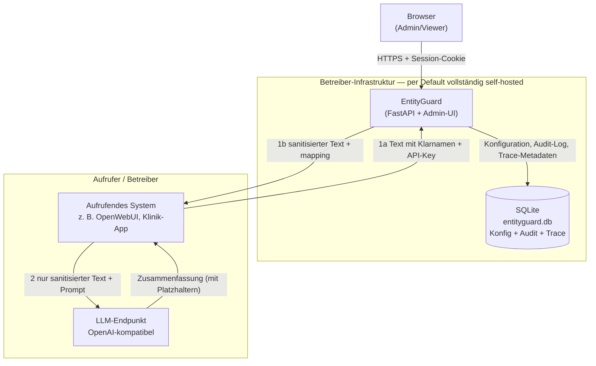

# Data Mapping

Technische Bestandsaufnahme, welche (personenbezogenen/medizinischen) Daten
durch EntityGuard fließen, wo sie herkommen, wohin sie gehen, wo sie liegen und
wie lange. Gedacht als Ausgangspunkt für ein Verzeichnis von
Verarbeitungstätigkeiten (Art. 30 DSGVO), eine Datenschutz-Folgenabschätzung
(Art. 35 DSGVO) oder ein Gespräch mit der Rechtsabteilung/dem
Datenschutzbeauftragten — ersetzt keine Rechtsberatung und keine
Einzelfallprüfung der jeweiligen Betriebsumgebung.

**Wichtig für Betreiber:** Dieses Dokument beschreibt den Datenfluss des
Codes in diesem Repository. EntityGuard ist eine **zustandslose
Anonymisierungsschicht**: Es speichert die zu anonymisierenden Texte
grundsätzlich **nicht**. Ob und in welchem Umfang dennoch Metadaten anfallen,
hängt von der Konfiguration der konkreten Instanz ab (Tracing, siehe unten).

## Systemübersicht

Die Nummerierung folgt dem zeitlichen Ablauf: (1) EntityGuard maskiert den
Text, (2) erst danach sieht das LLM ausschließlich den maskierten Text. Das
`mapping` (Platzhalter → Original) geht **an den Aufrufer zurück**, nicht ans
LLM. Siehe [`docs/pii.md`](pii.md) für den detaillierten Ablauf.

## Datenkategorien

| Kategorie | Beispiele | Wo im System |
|---|---|---|
| Zu anonymisierender Text (im Transit) | Freitext mit Namen, Orten, Daten, Fallnummern, ggf. Gesundheitsdaten | **Nur im Speicher** während der Anfrage; wird **nicht persistiert** |
| `mapping` (Platzhalter → Original) | `{"[PERSON_1]": "Müller"}` | **Nur im HTTP-Response an den Aufrufer**; wird **nicht persistiert** |
| Konfigurationsdaten | Entitäten, Muster (Regex), Kontextwörter, Ausnahmeliste | `entities`, `patterns`, `context_words`, `allowed_values` (SQLite) |
| Nutzerkonto-Daten (Admin/Viewer, keine Patienten) | Benutzername, bcrypt-Passwort-Hash, Rolle | `admin_users` (SQLite) |
| API-Zugangsdaten | App-Bezeichnung, key_prefix, bcrypt-Hash des Keys | `api_keys` (SQLite); Klartext nur einmalig beim Erzeugen |
| Audit-Log | Wer/wann/was bei Konfigurationsänderungen und Logins | `audit_log` (SQLite, append-only) |
| Trace-Metadaten (inhaltsfrei) | Quelle, Key-Präfix, Eingabelänge, Maskierungsanzahl, Latenz, Status, optional Input-HMAC | `request_trace` (SQLite), Retention `TRACE_RETENTION_DAYS` |

## Verarbeitungsschritte im Detail

| # | Schritt | Daten | Ziel/Empfänger | Code-Referenz |
|---|---|---|---|---|
| 1 | Anfrage | Text mit Klarnamen + API-Key | EntityGuard (`/api/v1/sanitize`) | `backend/views/anonymizer.py` |
| 2 | Analyse | Erkannte Entitäten (Presidio + spaCy + Muster + aktive Modelle) | Intern, flüchtig | `backend/components/cstm_analyzer.py` |
| 3 | Maskierung | Text mit indizierten Platzhaltern + Mapping | Antwort an den Aufrufer | `cstm_analyzer.py::process_text()` |
| 4 | Trace (optional) | **Nur Metadaten** (Länge, Maskierungsanzahl, Latenz, …) | `request_trace` | `backend/tracing.py::record_trace` |
| 5 | LLM-Aufruf (**durch den Aufrufer**) | Maskierter Text | Vom Betreiber konfigurierter LLM-Endpunkt | **Nicht Teil dieses Dienstes** |
| 6 | Admin-Aktionen | Login, Konfigurationsänderungen | `audit_log` | `log_audit(...)` in `backend/admin/routes.py` |

## Was EntityGuard NICHT speichert

- **Keinen Rohtext** und **kein `mapping`** — weder im Trace noch im Audit-Log.
- **Kein Maskierungsergebnis** (`sanitized_text`) — der Aufrufer erhält es nur
  als HTTP-Response und ist für die weitere Verarbeitung verantwortlich.
- **Keine Verbindungsdaten** außer der Client-IP im Audit-Log (bei Login und
  Konfigurationsänderungen).

Das ist die zentrale Eigenschaft des Dienstes: Er ist eine Durchlauf-Schicht,
kein Datenspeicher für Patientendaten.

## Verschlüsselung im Detail

### Ruhende Daten (at rest)

| Feld/Ort | Verschlüsselt? | Anmerkung |
|---|---|---|
| `admin_users.password_hash` | ✅ (Hash) | bcrypt, kein Klartext |
| `api_keys.key_hash` | ✅ (Hash) | bcrypt, kein Klartext; Klartext-Anzeige einmalig |
| Konfiguration, Audit-Log, Trace | ❌ | SQLite-Datei unverschlüsselt — die Datei selbst schützen (Dateisystem/Betriebssystem) |

EntityGuard besitzt **keine** Feldverschlüsselung (kein `ENCRYPTION_KEY`).
Die SQLite-Datenbank enthält keine Patientendaten, sondern nur Konfiguration
und Metadaten. Sie sollte dennoch über Dateisystem-Rechte geschützt werden.

### Daten in Übertragung (in transit)

Ob die Verbindung zu EntityGuard TLS-verschlüsselt ist, hängt davon ab, ob ein
TLS-terminierender Reverse Proxy davorsteht. Die Anwendung selbst terminiert
kein TLS (`main.py` hört auf Port `9500`). Innerhalb eines Docker-Netzwerks
läuft der Verkehr im internen Container-Netz; sobald der Dienst öffentlich
erreichbar ist, **muss** TLS über einen Reverse Proxy erzwungen werden — der
Text enthält bis zur Maskierung Klarnamen.

## Externe Stellen / mögliche Auftragsverarbeiter

**Per Default vollständig self-hosted** (derselbe Docker-Host):

- EntityGuard selbst
- SQLite (`data/entityguard.db`)
- Das deutsche spaCy-Modell (`de_core_news_lg`, lokal geladen)
- Optional zugeschaltete Transformer-Modelle — **laden Gewichte von
  HuggingFace beim ersten Einsatz** (siehe Lücke unten), laufen danach aber
  lokal

**Vom Betreiber konfiguriert — hier entscheidet sich, ob ein Drittanbieter/
Drittland im Spiel ist:**

- Der **LLM-Endpunkt** liegt außerhalb dieses Dienstes; EntityGuard kennt ihn
  nicht. Er bekommt ausschließlich den **maskierten** Text zu Gesicht.

## Aufbewahrung & Löschung

| Daten | Aufbewahrung |
|---|---|
| Zu anonymisierender Text, `mapping` | **Keine** — nur flüchtig im Speicher |
| Trace-Metadaten (`request_trace`) | Automatisch gelöscht nach `TRACE_RETENTION_DAYS` (Default 7 Tage, Bereinigung beim Start in `main.py`); Tracing per `TRACE_ENABLED=false` abschaltbar |
| Audit-Log (`audit_log`) | Append-only, **kein** automatisches Ablaufdatum — manuelle Löschung durch einen Admin |
| Konfiguration, Nutzer, API-Keys | Bis zur manuellen Löschung im Admin-UI |

Das Audit-Log enthält keine Patientendaten und unterliegt bewusst keiner
automatischen Löschung, damit die Nachvollziehbarkeit erhalten bleibt.

## Bekannte Lücken (Stand: siehe Git-Historie)

- **Keine Feldverschlüsselung**: Die SQLite-Datei ist unverschlüsselt. Sie
  enthält keine Patientendaten, aber Konfiguration und Metadaten; Schutz ist
  Aufgabe des Betreibers (Dateisystem, Volume-Rechte).
- **Kein TLS in der Anwendung**: TLS muss über einen Reverse Proxy terminiert
  werden, sonst liegen Klarnamen auf der Leitung.
- **Transformer-Modelle laden Gewichte aus dem Internet**: Beim ersten
  Aktivieren eines Modells lädt `transformers` die Gewichte von HuggingFace.
  Das ist kein Patientendaten-Transfer, aber ein ausgehender Verbindungsaufbau
  — in air-gapped Umgebungen vorab ins Modell-Cache spiegeln.
- **Sessions sind in-memory** (`backend/admin/auth.py::_sessions`): Ein Neustart
  meldet alle Admin/Viewer ab; Multi-Instance-Deployments teilen keine Sessions.
- **Audit-Log ohne automatische Löschung** — bewusst append-only.

## Verweise

- [`docs/pii.md`](pii.md) — detaillierter Ablauf der PII-Maskierung
- [`docs/audit-checklist-entityguard.md`](audit-checklist-entityguard.md) —
  Selbstauskunft entlang typischer Audit-Prüfpunkte
- [`SECURITY.md`](../SECURITY.md) — Sicherheitsarchitektur und
  Art.-32-Maßnahmen
- [`DISCLAIMER.md`](../DISCLAIMER.md) — Haftungs- und Einsatzhinweise
