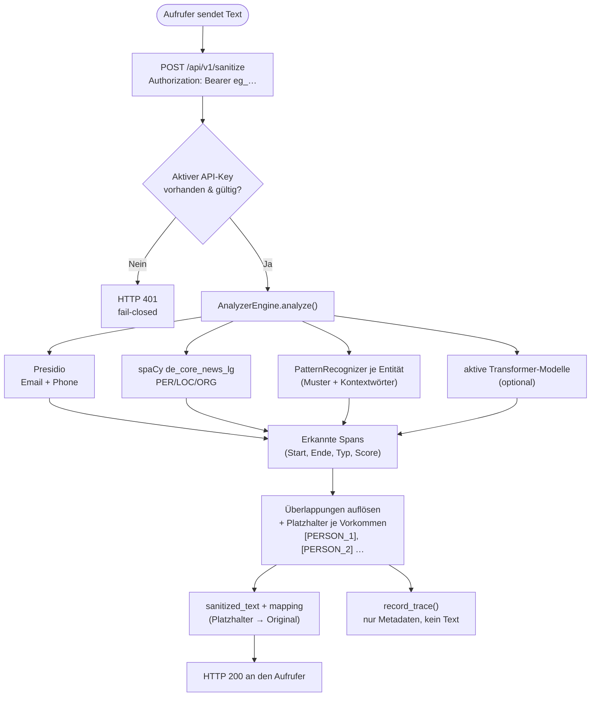

# PII-Maskierungs-Pipeline

Flussdiagramm und Vertrag des Verarbeitungswegs, den EntityGuard pro Anfrage
durchläuft. EntityGuard ist die Sanitizer-Seite; der Aufrufer (z. B. openDox,
OpenWebUI, eine Klinik-App) entscheidet, was mit dem maskierten Text und dem
`mapping` weiter geschieht.



## Erkennungsquellen

| Quelle | Erkennt | Code |
|---|---|---|
| **Presidio** (Standard) | E-Mail (`EMAIL_ADDRESS`), Telefon (`PHONE_NUMBER`) | `_remove_builtin_recognizers()` behält nur `SpacyRecognizer`, `EmailRecognizer`, `PhoneRecognizer` |
| **spaCy** `de_core_news_lg` | Personen, Orte, Organisationen (`PER`/`LOC`/`ORG`) — die deutsche NER emittiert **nur** diese drei | Presidio `SpacyRecognizer` |
| **Muster** (pro Entität) | Freie Regex bzw. Stichwortliste | ein `PatternRecognizer` pro Entität mit Mustern; Kontextwörter aus `context_words` |
| **Transformer-Modelle** (optional) | je nach Modell Namen/Orte/Organisationen oder strukturierte PII | `backend/components/bert_recognizer.py`, `BERT_MODEL_REGISTRY`; standardmäßig inaktiv |

Wodurch eine Entität tatsächlich erkannt wird, zeigt das Admin-UI pro Entität
(`BASE_ENTITY_SOURCES` + `_entity_sources`); Entitäten ohne Quelle werden als
„nicht erkannt" markiert.

## Response-Contract

```json
{
  "sanitized_text": "Herr [PERSON_1] aus [LOCATION_1]",
  "mapping": {"[PERSON_1]": "Müller", "[LOCATION_1]": "Berlin"}
}
```

- **Eindeutige Tokens pro Vorkommen**: Platzhalter werden durchnummeriert
  (`[PERSON_1]`, `[PERSON_2]`, …), nicht nur pro Kategorie. Damit kollidieren
  mehrere Vorkommen derselben Entität nicht im `mapping`-Dict.
- **Platzhalter kommen aus der `entities`-Tabelle**: Ist eine Entität inaktiv
  oder hat keine DB-Zeile, werden ihre Treffer verworfen (kein Platzhalter).
  Der Fallback `[SENSITIV]` greift nur, wenn ein erkannter Typ keine Zeile hat.
- **Das `mapping` geht an den Aufrufer zurück, nicht ans LLM.** Der Aufrufer
  kann damit später de-anonymisieren (z. B. OpenWebUI `outlet()`), muss das
  Mapping aber selbst aufbewahren. EntityGuard speichert es **nicht**.

## Fail-Closed-Verhalten

- **Kein gültiger API-Key:** HTTP 401, kein Text wird verarbeitet.
- **Fehler in der Pipeline:** HTTP 500; der Dienst gibt **niemals** den
  unverarbeiteten Text zurück. Der Aufrufer entscheidet, ob er die Anfrage
  daraufhin blockiert (empfohlen) — die Referenz-OpenWebUI-Einbindung tut das.

## Trace (inhaltsfrei)

`backend/tracing.py::record_trace` schreibt pro API-Anfrage **nur** Metadaten:
Quelle, Key-Präfix, Eingabelänge, Maskierungsanzahl, Anzahl je Entitätstyp,
Latenz, Erfolg und — falls `TRACE_HMAC_SECRET` gesetzt ist — einen
HMAC-SHA256 des Inputs zur Korrelation. **Nie** Text, **nie** `mapping`. Die
Admin-Testseite (`/admin/sanitize/api`) wird bewusst nicht getraced (Live-
Vorschau feuert bei jedem Tippen). Retention siehe
[`docs/data-mapping.md`](data-mapping.md).

## Konfiguration

- **API-Key:** im Admin-UI unter **API-Schlüssel** erzeugen (pro App,
  mehrere möglich, an-/ausschaltbar). Header: `Authorization: Bearer eg_…`
  oder `X-API-Key: eg_…`.
- **Erkennung:** Entitäten, Muster und Kontextwörter im Admin-UI pflegen;
  danach `POST /api/v1/reload` oder der Reload-Knopf im UI.
- **Modelle:** `/admin/modelle` schaltet Transformer-Modelle zu (sofortiger
  Analyzer-Neuaufbau).
